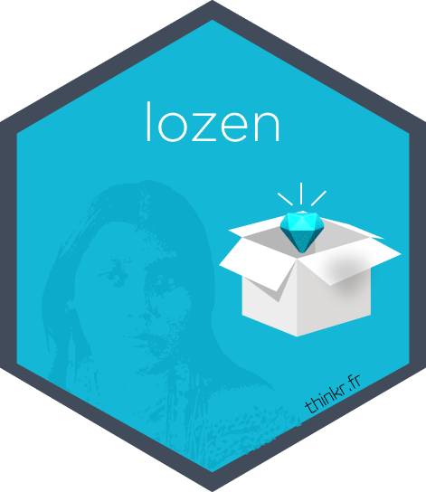

<!-- README.md is generated from README.Rmd. Please edit that file -->

# {lozen} 

<!-- badges: start -->

[](https://github.com/ThinkR-open/lozen/actions/workflows/R-CMD-check.yaml)
[](https://github.com/ThinkR-open/lozen/actions/workflows/test-coverage.yaml)
[](https://app.codecov.io/gh/ThinkR-open/lozen?branch=main)
<!-- badges: end -->

The objective of {lozen} is to centralize project management tools for
Devs and Lead Devs.

## Installation

``` r
remotes::install_github(
  repo = "ThinkR-open/lozen",
  ref = "main",
  build_vignettes = TRUE,
  upgrade = "never")
```

## Documentation

### Package website

Access to the pkgdown: <https://thinkr-open.github.io/lozen/>

### Vignettes/articles

*Documentation dedicated to the users (Devs, Lead Devs)*

- `aa - Create a new project with GitLab`: Create a new R project for a
  mission - managed on GitLab, with everything needed (the R project
  skeleton, the init of git, the init of the project on GitLab, etc.)
- `ab - Create a new project with GitHub`: Create a new R project for a
  mission - managed on GitHub, with everything needed (the R project
  skeleton, the init of git, the init of the project on GitLab, etc.)
- `ac - Create Weekly with GitHub or GitLab`: Generate a weekly/daily
  for a mission

*Documentation dedicated to the team who participates to the
develompment of {lozen}*

- `ba - Create the skeleton of the R project (package, app, book)`
- `bb - Manage git tools (branches, commits, etc.)`
- `bc - Manage GitLab projects`
- `bd - Manage GitHub Projects`
- `be - Initilialise GitLab CI`
- `bf - Create special issues`
- `bg - Deploy on Connect`
- `bh - Deploy on Connect through GitLab CI`
- `bi - Move from GitLab to GitHub`
- `ca - Tools miscellaneous`

## As developper

Please visit the folder dev, you will find a readme that will explain
you how to set up env var to developp {lozen}
